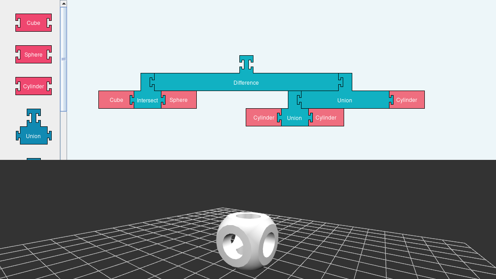
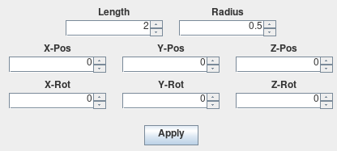

# Blockbased CSG Tool

## About
This is a simple proof of concept tool to show the possibility of combining a block based user interface with modeling. This tool enables you to create simple models using Constructive Solid Geometry by clicking and dragging blocks around. 

## Installation

### Requirements
- Gradle
- Java 8

### Building
Clone the repository using git. (Or download the source code manually and extract it.)

`` git clone  https://git.haw-hamburg.de/aci876/blockcsg.git``

Move into the directory of the cloned repository.

``cd blockcsg/``

Now start Gradle and build the project.

``gradle build``

To run the program use

`` gradle run ``

or execute the fat jar contained in ``blockcsg/build/lib``.

``java -jar build/lib/blockcsg.jar``

## Usage

Upon opening the program you will see a window with a bottom viewport and a upper empty workspace.

To move the camera of the viewport hold left click and drag the mouse.

To add a block, simply drag and drop a block from the left side of the workspace and place it on the empty canvas. Pink blocks represent primitive shapes and are the foundation of a CSG shape. Blue blocks are the operands and connect primitives or results of other operands together creating a new model. To get a valid new model you need to connect to blocks to an operand. By chaining together multiple operands and primitive blocks you can create CSG trees.

The blocks can only connect in a certain way, indicated by their connection points. Furthermore they grow dynamically in size to accomodate the increasing nesting level.

To delete a block, simply drag it out of bounds or back into the block selection.

If you want to change dimensions, position or rotation of a block, simply right click the block in the workspace and a popup with configurable options should appear.

Note: When moving or rotating an operand, all children of the moved operand will also be moved or rotated.

If you are happy with the result you can select File > Export in the toolbar to export the current selected model to an .obj file.
(Current selected = highlighted model / blocks)

## Known issues
- Application raises an error when an operation leaves the mesh empty.
- Export of some type of models raises an error.